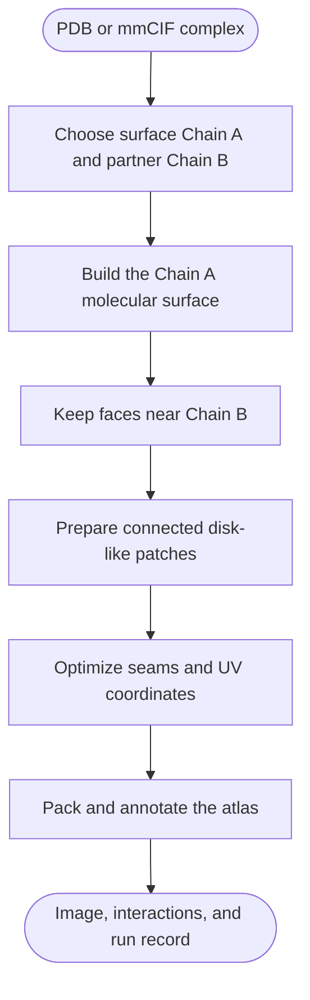

# TopoPPI

<p align="center">
  
</p>

TopoPPI helps you explore where two proteins meet. Open a PDB or mmCIF structure, choose a pair of chains, and view their interaction surface as a **2D atlas** or an interactive **3D interface**.

Highlight residues, inspect their contacts, and color the interface with your own numerical data. Save an editable atlas to return to your work, or export figures as PNG, TIFF, SVG or PDF. The desktop app, command line and Python API use the same mapping and annotation tools.

**Get started:** [Windows](#windows) · [macOS](#macos) · [Linux](#linux) · [Command line](#command-line) · [Python API](#python-api)

## Example outputs

These four outputs show the same KRAS–RAF1 interface (PDB **6VJJ**, surface chain A, partner chain B). Magenta highlights Ile36, Glu37, Asp38 and Tyr40 in the first three views.

| **2D residue footprints** | **3D interface** |
| --- | --- |
|  |  |
| See the full interface and the area occupied by each residue. | Follow the surface shape while retaining the same residue annotations. |
| **Residue markers** | **Numerical annotations** |
|  |  |
| Locate contacting residues and follow their labels across the map. | Load a CSV file to map your values onto residue regions. |

The numerical example counts contacting partner residues using a 6 Å heavy-atom distance cutoff. See the [Residue footprints guide](https://github.com/GeraltZeroZhong/TopoPPI/blob/HEAD/docs/residue_footprints.md) for CSV formatting and the [3D interface guide](https://github.com/GeraltZeroZhong/TopoPPI/blob/HEAD/docs/3d_interface.md) for camera and display controls.

## Choose a starting point

| Your goal | Start here |
| --- | --- |
| Make a first map on Windows | [Install the Windows app](#windows) and use the **Basic** page |
| Make a first map on a Mac | [Install the macOS app](#macos) and use the **Basic** page |
| Use Linux or automate one structure | [Install with Conda and pip](#linux) and run `topoppi` |
| Call TopoPPI from Python | [Python API](#python-api) |
| Inspect a saved atlas in three dimensions | [3D interface view](#3d-interface-view) |
| Compare methods across a dataset | [Benchmark a dataset](#benchmark-a-dataset) |
| Reproduce a publication study | [Publication workflow tools](https://github.com/GeraltZeroZhong/TopoPPI/blob/HEAD/tools/publication/README.md) |

## Install TopoPPI

Choose the **TopoPPI 2.1** package for your operating system below.

### Windows

Download the 64-bit Windows installer:

```text
TopoPPI-2.1-windows-x86_64-setup.exe
```

Get the installer from the [v2.1 release](https://github.com/GeraltZeroZhong/TopoPPI/releases/tag/v2.1). Open it and keep its setup window open while it creates the private environment. A fresh installation commonly takes 5–15 minutes and uses GitHub, conda-forge, and PyPI. After setup, open **TopoPPI GUI** from the Start Menu. Routine analysis of local structures can run offline.

The current installer is unsigned, so Windows SmartScreen may ask you to confirm the file. Download it from the project release page, select **More info**, then select **Run anyway**. Upgrade, repair, removal, and local build instructions are in the [Windows guide](https://github.com/GeraltZeroZhong/TopoPPI/blob/HEAD/installer/windows/README.md).

### macOS

Download the disk image for your Mac's architecture:

```text
TopoPPI-2.1-macos-arm64.dmg       Apple Silicon
TopoPPI-2.1-macos-x86_64.dmg      Intel
```

Get the disk image from the [v2.1 release](https://github.com/GeraltZeroZhong/TopoPPI/releases/tag/v2.1). Open it, drag **TopoPPI** to **Applications**, and open the app. The app uses ad-hoc signing. If macOS blocks it, open **System Settings > Privacy & Security**, choose **Open Anyway** for TopoPPI, and confirm **Open**. Older macOS releases may also offer **Open** through the app's Control-click menu. Keep the preparation window open while the bundled runtime expands. Later launches reuse that runtime.

The app includes Python, scientific dependencies, and native OptCuts, and supports macOS 12 or later. Startup recovery, upgrades, removal, and local build instructions are in the [macOS guide](https://github.com/GeraltZeroZhong/TopoPPI/blob/HEAD/installer/macos/README.md).

### Linux

TopoPPI uses Python 3.10. Create an environment, install version 2.1 from PyPI, and launch the desktop app:

```bash
conda create -n topoppi -c conda-forge \
  python=3.10 tk igl=2.6.* numpy scipy biopython scikit-image \
  matplotlib trimesh networkx pillow rtree shapely \
  mdanalysis rdkit psutil tqdm meshio pip
conda activate topoppi
python -m pip install "topoppi[all]==2.1"
topoppi-install-optcuts
command -v OptCuts_bin
topoppi-gui
```

`topoppi-install-optcuts` downloads the Linux x86-64 executable matching the installed release. Other Linux architectures use a locally built executable through `TOPOPPI_OPTCUTS_BIN`. To work from a source checkout, install with `python -m pip install ".[all]"` and use `bash tools/OptCuts/install_optcuts.sh` from the repository root.

## Create an interface map

### Desktop app

Launch `topoppi-gui`, or open the installed application on Windows or macOS.

<details>
<summary>Desktop screenshots: 2D atlas and 3D interface</summary>

**2D atlas:** inspect residue regions and adjust labels, highlights and colors.


**3D interface:** rotate the surface and save the view for later editing or export.


</details>

1. On **Basic**, choose a `.pdb`, `.cif`, or `.mmcif` structure.
2. Review the detected protein chains and residue counts.
3. Set **Surface chain** to the protein whose surface you want to map.
4. Set **Partner chain** to the contacting protein. **Swap A/B** maps the opposite surface.
5. Choose the output folder and interaction types.
6. Select **Create Interface Map**.

Once the result appears, choose **2D atlas** or **3D interface** under **View**. Use **Map style** to switch between residue markers and filled residue footprints. **Save Atlas** keeps the result editable; **Save Figure** exports the current view.

TopoPPI generates ProLIF annotations when no interaction JSON is supplied. The completed run writes the image, its `.topoppi.json` run record, and the generated `.prolif.json` file to the chosen output folder. Advanced settings expose the surface, topology, UV, OptCuts, labeling, and export controls.

The **Help** menu shows the installed version and opens the user guide or issue tracker. During a run, the status area reports `Load`, `Surface`, `Patch`, `OptCuts`, and `Render` progress.

The map panel identifies the structure and chain pair it displays. Preparing another input leaves the current atlas available for editing and saving. Once computation finishes, display settings can be adjusted with **Apply Style** using the calculated atlas.

### Command line

The shortest command is:

```bash
topoppi path/to/complex.pdb \
  --chain-a A \
  --chain-b B \
  --output interface_map.png
```

This creates:

```text
interface_map.png
interface_map.topoppi.json
complex.A-B.prolif.json
```

The generated ProLIF file is placed beside the output image. Supply an existing file with `--prolif interactions.json` when interaction evidence has already been prepared.

For a Linux x86-64 source checkout, this small smoke run uses the included fixture and interaction record:

```bash
topoppi tests/fixtures/tiny_complex.pdb \
  -A A -B B \
  --prolif tests/fixtures/prolif_interactions.json \
  --optcuts-bin tools/OptCuts/OptCuts_bin \
  -o /tmp/topoppi-interface.png
```

Useful defaults and options:

| Option | Default | Purpose |
| --- | ---: | --- |
| `-A`, `--chain-a` | `A` | Surface protein |
| `-B`, `--chain-b` | `B` | Partner used to locate the interface |
| `--cutoff` | `4.0 Å` | Maximum surface-face distance to Chain B |
| `--min-points` | `1` | Minimum interaction residues per visible 2D marker patch |
| `--residue-scope` | `interaction` | Annotation scope; footprints and 3D views default to `patch` |
| `--map-style` | `markers` | `footprints` draws filled residue regions, boundaries, and seams |
| `--view` | `atlas` | `surface` displays the interface in 3D |
| `--projection` | `orthographic` | `perspective` adds camera perspective in 3D |
| `--elevation`, `--azimuth`, `--zoom` | `73`, `-90`, `1` | 3D camera angles in degrees and positive zoom factor |
| `--no-mesh`, `--show-mesh` | shown | Hide or show the 3D triangular mesh |
| `--interaction-source` | `prolif` | `geometric` explicitly uses heavy-atom contact partners for optimization weights |
| `--res` | `1.0 Å` | Surface grid spacing |
| `--max-voxels` | `40,000,000` | Dense-grid allocation budget |
| `--parameterization` | `auto` | Initial UV parameterization |
| `--residue-fragmentation-weight` | `20` | Residue-aware seam objective strength |
| `--optcuts-timeout` | `600 s` | OptCuts budget for each patch |
| `--prolif` | empty | Existing ProLIF JSON |
| `-o`, `--output` | `interface_map.png` | PNG, TIFF, SVG, or PDF image path |
| `--export-atlas` | empty | Save a self-contained NPZ atlas for later rendering |

Run `topoppi --help` for mapping options and `topoppi render --help` for saved-atlas editing and `topoppi --version` to check the active installation. Add `--show` when you want the Matplotlib window to remain open after saving.

### Residue footprints

Choose **Residue footprints** in the desktop app's **Map Display** controls, or add `--map-style footprints` to a CLI run. This style draws complete residue regions, including disconnected pieces, in either the 2D atlas or the 3D interface view. It supports selected-residue highlighting, external numerical annotations, boundary and seam controls, and editable SVG/PDF exports.

```bash
topoppi complex.cif -A A -B B --map-style footprints \
  --highlight A:GLU:37 A:TYR:40 \
  --export-atlas interface.atlas.npz -o interface.svg

topoppi render interface.atlas.npz --annotation-file effects.csv \
  --annotation-label 'Effect (kcal/mol)' -o interface_effects.pdf
```

`effects.csv` contains `residue,value` columns, with source author residue identifiers and numeric values or `NA`. Saved atlases retain geometry, interactions, numerical annotations and plotting style. **Save Atlas / Open Atlas** and `topoppi render` support further editing without the original input files or a new optimization. The GUI supports region recoloring and label dragging. Numerical annotations set region colors and supply a shared value scale; **Clear** restores the manual color layer.

CSV files use UTF-8, including exports with a byte-order mark. Colorbar arrowheads show when values extend beyond a selected scale. The GUI distinguishes annotations for the current map from those prepared for the next run.

See the [Residue footprints guide](https://github.com/GeraltZeroZhong/TopoPPI/blob/HEAD/docs/residue_footprints.md) for CSV examples, complete options, the Python API and reproducible rendering.

### 3D interface view

In **Map Display**, set **View** to **3D interface** and choose **Residue markers** or **Residue footprints** under **Map style**. Drag to rotate; use the navigation toolbar to pan or zoom. **Mesh**, **Projection** and **Reset view** control the surface display and camera. Double-click a visible residue to edit its manual color. Numerical annotations share the value scale used by the atlas.

To render a saved atlas in 3D:

```bash
topoppi render interface.atlas.npz \
  --view surface --map-style footprints \
  --highlight A:GLU:37 A:TYR:40 --labels highlighted \
  --elevation 73 --azimuth -90 --zoom 1 \
  --export-atlas surface.atlas.npz -o interface_3d.png

topoppi render surface.atlas.npz --no-mesh -o interface_3d.pdf
topoppi render surface.atlas.npz --view atlas -o interface_2d.svg
```

The 3D view uses the stored surface vertices and preserves the relative positions of all retained patches. Switching views reuses the completed atlas. **Save Atlas** preserves the camera for subsequent editing and export. Rendering runs entirely in TopoPPI with Matplotlib; PyMOL is optional for separate molecular illustrations.

See the [3D interface guide](https://github.com/GeraltZeroZhong/TopoPPI/blob/HEAD/docs/3d_interface.md) for camera settings, annotations and the Python API.

### Python API

```python
from topoppi.config import TopoPPIRunConfig
from topoppi.pipeline import run_interface_mapping

result = run_interface_mapping(
    TopoPPIRunConfig(
        pdb_file="complex.pdb",
        chain_a="A",
        chain_b="B",
        output_file="results/complex_A-B.png",
    )
)

print(result.output_file)
print(result.manifest_file)
print(result.elapsed_sec)
```

Configuration dataclasses live in [`src/topoppi/config.py`](https://github.com/GeraltZeroZhong/TopoPPI/blob/HEAD/src/topoppi/config.py). The same settings feed the CLI, desktop app, Python pipeline, and benchmark runner.

Python calls use a native OptCuts executable. On Linux x86-64, the [source setup](#install-from-a-linux-x86-64-source-checkout) installs the supplied binary; `topoppi-install-optcuts` serves published pip installations. The [Windows installer](https://github.com/GeraltZeroZhong/TopoPPI/blob/HEAD/installer/windows/README.md) configures the bundled Windows executable, while standalone Windows environments can run `topoppi-install-optcuts --platform windows-x86_64`. On macOS, follow the [native build instructions](https://github.com/GeraltZeroZhong/TopoPPI/blob/HEAD/installer/macos/README.md#build-locally). Set `TOPOPPI_OPTCUTS_BIN` to the resulting executable when it is outside the active environment's command path.

## Understand the result



### Read the map

- Each island is a connected piece of the selected Chain A interface surface.
- The mesh shows the flattened surface geometry. Island boundaries include natural patch boundaries and optimization seams.
- Residue regions and markers belong to Chain A. Their labels can also show paired Chain B residues.
- Marker colors encode the selected interaction classes. Footprint mode uses a neutral region color, selected-residue highlights, or a numerical value scale.
- A residue split by a seam can appear on more than one island. TopoPPI places a marker on every connected UV footprint piece.
- Two-dimensional spacing describes the optimized atlas. Use the source structure for physical three-dimensional distance measurements.

The adjacent `.topoppi.json` file records the exact input hash, chains, settings, software environment, OptCuts executable, stage timings, surface diagnostics, topology evidence, display scope, and interaction counts. Keep it with figures used in analysis or publication.

### Mapping details

- TopoPPI reads the first structural model and uses recognized amino-acid heavy atoms from Chain A.
- The molecular surface is a Gaussian-density isosurface extracted with marching cubes.
- Interface faces are selected from their distance to Chain B heavy atoms. GUI, CLI, and Python single-run defaults all use `4.0 Å`.
- UV coordinates are stored per face corner, so both sides of a seam keep their own coordinates.
- Multiple retained patches are packed with deterministic transforms and an explicit chart gap.

TopoPPI extends OptCuts with residue-footprint fragmentation energy. For an original footprint component with mass `M` split into pieces with masses `m_k`, the contribution is:

```text
1 - sum((m_k / M)^2)
```

Each residue receives the weight `1 + contact degree`, where contact degree is the number of distinct Chain B partners in the ProLIF records by default. With `--interaction-source geometric`, it counts partners within the specified heavy-atom distance. The standard TopoPPI weight is `20`. A weight of `0` selects the matched geometry-only ablation used in benchmark comparisons. The [benchmark schema](https://github.com/GeraltZeroZhong/TopoPPI/blob/HEAD/docs/benchmark_schema.md#residue-footprint-fragmentation) gives the formal definition and exported evidence.

## Interaction annotations

With the default `--interaction-source prolif`, TopoPPI uses interaction evidence in this order:

1. Read the ProLIF JSON supplied through the CLI, Python configuration, or Advanced desktop page.
2. Generate a chain-pair ProLIF JSON with MDAnalysis, ProLIF, and RDKit.
3. Use geometric interaction assignment when the user enables that diagnostic fallback.

Choose `--interaction-source geometric` to use distance-based partners directly and skip ProLIF generation. The contact distance is controlled by `--geometric-fallback-distance` (default `6 Å`); `--cutoff` separately defines the mapped surface domain (default `4 Å`). This selection changes optimization weights. Footprint colors and external annotations are applied after optimization.

During generation, TopoPPI prepares isolated RDKit copies of the selected chains, adds explicit hydrogens, and runs the ProLIF fingerprint. Source coordinates stay unchanged. Generated metadata binds the records to the structure SHA-256, chain direction, interaction schema, and TopoPPI version.

The display normalizes ProLIF subclasses into `HydrogenBond`, `Ionic`, `PiStacking`, `PiCation`, `Hydrophobic`, `HalogenBond`, `MetalCoordination`, `VdWContact`, and `Other`. PDB insertion codes are retained when they resolve uniquely.

Use `--residue-scope patch` or **Full patch context** to label the surrounding flattened surface. The standard `interaction` scope labels residues supported by the resolved interaction records.

## Benchmark a dataset

`topoppi-benchmark` supports resumable quality studies, uncontended performance measurements, sensitivity plans, and evidence-bundle verification. Start with the small source-tree example to learn the command flow:

```bash
topoppi-benchmark preflight docs/benchmark_quickstart.example.json
topoppi-benchmark run docs/benchmark_quickstart.example.json
topoppi-benchmark verify benchmark_results/quickstart/benchmark_report.json
```

The default terminal output is a concise status summary. Add `--json` for the full structured result, or use `--output-json PATH` on preflight commands to write it directly.

### Choose a benchmark purpose

| Purpose | Measures | Formal run shape |
| --- | --- | --- |
| `quality` | Distortion, flips, seams, fragmentation, retention | One measured repetition, no warm-up |
| `performance` | Wall time, memory, completion, timeouts | At least three repetitions and one warm-up on one worker |

The `comparative` profile evaluates parameterizations and selected OptCuts arms on a shared source-face domain. The `operational_optcuts` profile measures one automatic OptCuts arm as an end-to-end operation.

### Prepare a formal run

Use these tracked files:

- [formal configuration example](https://github.com/GeraltZeroZhong/TopoPPI/blob/HEAD/docs/benchmark_config.example.json)
- [manifest template](https://github.com/GeraltZeroZhong/TopoPPI/blob/HEAD/docs/benchmark_manifest_template.csv)
- [evidence schema and protocol](https://github.com/GeraltZeroZhong/TopoPPI/blob/HEAD/docs/benchmark_schema.md)

Replace the example paths, commit ID, coordinate-audit digest, OptCuts digest, chains, and dataset metadata with frozen study values. A formal run then follows:

```bash
python tools/publication/prepare_manifest_prolif.py \
  --manifest ../topoppi-study/dataset/benchmark_manifest.csv \
  --structure-dir ../topoppi-study/dataset \
  --output-manifest ../topoppi-study/dataset/benchmark_manifest.prolif.csv
```

Keep study inputs and generated evidence outside the source checkout. Use the prepared manifest for the coordinate audit and benchmark configuration. The command generates one chain-bound ProLIF JSON per included structure and fills the required `prolif_file` and `prolif_sha256` columns. The [publication tools guide](https://github.com/GeraltZeroZhong/TopoPPI/blob/HEAD/tools/publication/README.md#bind-prolif-evidence) covers paired cohorts.

```bash
topoppi-benchmark preflight benchmark_config.json \
  --output-json benchmark_preflight.json

topoppi-benchmark run benchmark_config.json \
  --confirm-formal-benchmark

topoppi-benchmark verify \
  benchmark_results/formal_run/benchmark_report.json
```

Formal mode connects the result to an explicit manifest, clean Git commit, OptCuts SHA-256, coordinate audit, input checksums, chain pairs, and interaction declarations. Resume state uses the same configuration fingerprint.

### Run a sensitivity study

Include `optcuts_automatic` in the baseline configuration. Create, inspect, and execute a one-factor plan with:

```bash
topoppi-benchmark plan-sensitivity \
  benchmark_config.json \
  docs/sensitivity_axes.example.json \
  --design one_factor \
  --plan-root sensitivity_study

topoppi-benchmark preflight-sensitivity \
  sensitivity_study/sensitivity_plan.json \
  --output-json sensitivity_study/preflight.json

topoppi-benchmark run-sensitivity \
  sensitivity_study/sensitivity_plan.json \
  --confirm-formal-benchmark
```

Supported axes include interface cutoff, grid spacing, Gaussian sigma, isovalue, OptCuts initial lambda, and distortion bound. The [sensitivity section](https://github.com/GeraltZeroZhong/TopoPPI/blob/HEAD/docs/benchmark_schema.md#sensitivity-plans) defines scenario IDs, design rules, and result files.

### Keep the evidence bundle

The main artifacts are:

| Artifact | Contents |
| --- | --- |
| `benchmark_report.json` | Configuration, runtime, per-structure records, metric protocol, and aggregate statistics |
| `benchmark_summary.csv` | One row for each attempted structure |
| `benchmark_manifest.csv` | Accepted and excluded inputs, chains, hashes, and grid estimates |
| `benchmark_failures.csv` | Preprocessing, method, timeout, and resource failures |
| `benchmark_per_patch.csv` | Patch geometry and biological-retention evidence |
| `benchmark_per_face_sample.csv` | Deterministic source-face audit sample |
| `benchmark_per_residue.csv.gz` | Residue fragmentation and seam-crossing evidence |
| `benchmark_provenance.csv.gz` | Final-to-source face, vertex, and atom mappings |
| `benchmark_optcuts_executions.jsonl.gz` | Commands, hashes, settings, and per-patch OptCuts diagnostics |
| `benchmark_artifact_checksums.json` | SHA-256 and byte count for the evidence artifacts |

See the [schema](https://github.com/GeraltZeroZhong/TopoPPI/blob/HEAD/docs/benchmark_schema.md) for every field, comparison domain, missing-value rule, statistical unit, and verification check. Publication cohort preparation and paired analyses are documented in the [publication tools guide](https://github.com/GeraltZeroZhong/TopoPPI/blob/HEAD/tools/publication/README.md).

## Install from a Linux x86-64 source checkout

This procedure uses the Linux x86-64 OptCuts executable tracked in the source tree. Use the [Windows native build guide](https://github.com/GeraltZeroZhong/TopoPPI/blob/HEAD/installer/windows/README.md#build-locally) or [macOS native build guide](https://github.com/GeraltZeroZhong/TopoPPI/blob/HEAD/installer/macos/README.md#build-locally) when developing on those platforms.

```bash
git clone https://github.com/GeraltZeroZhong/TopoPPI.git
cd TopoPPI
conda env create -f environment.yml
conda activate topoppi-dev
python -m pip install -e ".[dev,benchmark,meshio]"
bash tools/OptCuts/install_optcuts.sh
command -v OptCuts_bin
```

The checkout includes a Linux x86-64 OptCuts executable for development. Rebuild the pinned residue-aware source with:

```bash
bash tools/OptCuts/build_residue_aware_optcuts.sh \
  tools/OptCuts/OptCuts_bin
```

The [OptCuts notice](https://github.com/GeraltZeroZhong/TopoPPI/blob/HEAD/tools/OptCuts/NOTICE.md) records the upstream commit, patch behavior, executable SHA-256, platform distribution, and license. The [residue-aware integration guide](https://github.com/GeraltZeroZhong/TopoPPI/blob/HEAD/tools/OptCuts/residue_aware/README.md) documents the sidecar and C++ state engine.

TopoPPI resolves the executable from `TOPOPPI_OPTCUTS_BIN`, the configured path or command name, then the active `PATH`. Point to a local build with:

```bash
export TOPOPPI_OPTCUTS_BIN=/absolute/path/to/OptCuts_bin
```

## Troubleshooting

### OptCuts cannot be found

Activate the intended environment. In a Linux x86-64 source checkout, install its executable:

```bash
bash tools/OptCuts/install_optcuts.sh
command -v OptCuts_bin
```

For a published pip installation, run `topoppi-install-optcuts` to download the matching release executable. Use `topoppi-install-optcuts --force` to replace the executable at the selected destination. Windows and macOS users should follow the native OptCuts guidance in the [Python API section](#python-api).

### A chain is missing

TopoPPI reports the available protein chains from the first model. Check capitalization, choose two distinct chains, and use **Swap A/B** when the intended surface is currently the partner. The desktop chain preview also shows residue counts.

### No interface patch is found

Confirm that the file contains the intended biological assembly and chain pair. Compare the partner distance with the `4.0 Å` interface cutoff and increase `--cutoff` gradually for a wider coordinate gap.

### ProLIF generation fails

Check that both chains contain complete protein residues and that the interaction stack imports:

```bash
python -c "import MDAnalysis, prolif, rdkit; print('interaction stack ready')"
```

You can supply a prepared record with `--prolif FILE`. For a distance-based diagnostic, enable `--geometric-interaction-fallback`.

### Surface generation reaches the voxel budget

Single runs can coarsen the grid up to `--max-adaptive-resolution`. Increase `--res`, raise `--max-adaptive-resolution`, or increase `--max-voxels` when memory permits. Formal fixed-resolution studies should record the chosen budget in their configuration and preflight report.

### The desktop app does not start

- Windows startup errors are written to `%LOCALAPPDATA%\TopoPPI\gui-startup.log`; follow the [repair steps](https://github.com/GeraltZeroZhong/TopoPPI/blob/HEAD/installer/windows/README.md#repair-an-installation).
- macOS startup errors are written to `~/Library/Logs/TopoPPI/launcher.log`; follow the [runtime rebuild steps](https://github.com/GeraltZeroZhong/TopoPPI/blob/HEAD/installer/macos/README.md#repair-startup).
- Linux users can start `topoppi-gui` from a terminal to see the active environment and import error.

## Develop, cite, and license

Run the project checks with:

```bash
conda activate topoppi-dev
python -m pytest
python -m ruff check .
```

For headless Linux testing, use `xvfb-run -a python -m pytest` so the Tk interaction tests run as they do in CI.

The complete contribution workflow is in [CONTRIBUTING.md](https://github.com/GeraltZeroZhong/TopoPPI/blob/HEAD/CONTRIBUTING.md). Cite TopoPPI with [CITATION.cff](https://github.com/GeraltZeroZhong/TopoPPI/blob/HEAD/CITATION.cff).

TopoPPI is distributed under the [MIT License](https://github.com/GeraltZeroZhong/TopoPPI/blob/HEAD/LICENSE). OptCuts redistribution details are in the [build and license notice](https://github.com/GeraltZeroZhong/TopoPPI/blob/HEAD/tools/OptCuts/NOTICE.md) and its upstream [`LICENSE.txt`](https://github.com/GeraltZeroZhong/TopoPPI/blob/HEAD/tools/OptCuts/LICENSE.txt).
