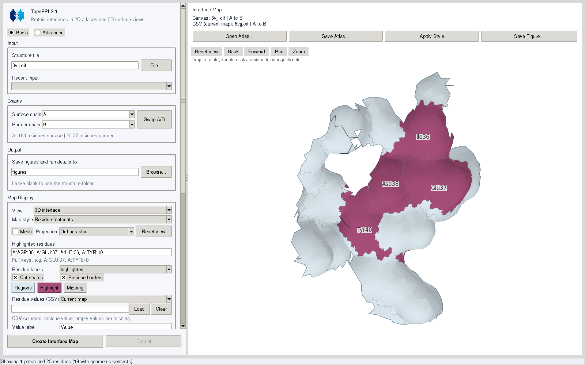

# 3D interface view



TopoPPI 2.1 renders the calculated interface as a shaded three-dimensional surface. It uses the original mesh vertices and the residue identities already stored in the atlas. All retained patches share a common display frame and preserve their original relative positions. Residue footprints follow the curved surface, and seam outlines locate the cuts used by the two-dimensional atlas.

Rendering uses the Matplotlib backend included with TopoPPI. An existing atlas supplies the geometry, interactions, residue values and saved camera needed for viewing and export.

## Open an interface in the desktop app

1. Compute an interface or choose **Open Atlas** to load a saved result.
2. In **Map Display**, set **View** to **3D interface**.
3. Choose **Residue markers** or **Residue footprints** under **Map style**. The representation and viewing dimension are independent settings.
4. Drag on the surface to rotate it. Use the navigation toolbar to pan or zoom, and **Reset view** to restore the initial camera.
5. Use **Mesh**, the residue border and seam controls, and **Projection** to adjust the display. Orthographic projection gives a uniform visual scale; perspective projection adds depth-dependent scaling.
6. Select **Save Figure** to export the view, or **Save Atlas** to retain its editable geometry, annotations and camera.

Switching between **2D atlas** and **3D interface** uses the completed result and restores the previous 3D camera. Labels follow their residues as the surface rotates. Double-click a visible residue to change its manual color. The 2D view also supports dragging labels to adjust their placement.

## Render from the command line

To reuse a saved atlas:

```bash
topoppi render interface.atlas.npz \
  --view surface --map-style footprints \
  --highlight A:GLU:37 A:TYR:40 --labels highlighted \
  --export-atlas surface.atlas.npz \
  -o interface_3d.png
```

To select a camera and simplify the surface outlines:

```bash
topoppi render surface.atlas.npz \
  --projection orthographic --elevation 60 --azimuth -70 --zoom 1.15 \
  --no-mesh --hide-residue-borders \
  --export-atlas focused.atlas.npz -o focused.pdf
```

Angles are measured in degrees within the automatically oriented interface frame. A larger positive zoom factor enlarges the surface. Unspecified options keep their saved values. Explicit camera options establish a new view from the selected angles and zoom, clearing any saved interactive pan limits.

Restore the mesh or borders with `--show-mesh` and `--show-residue-borders`; `--show-seams` restores optimized seam outlines. To export the same atlas in 2D:

```bash
topoppi render focused.atlas.npz --view atlas -o interface_2d.svg
```

New calculations accept the same view options:

```bash
topoppi complex.cif -A A -B B \
  --view surface --map-style footprints \
  --export-atlas interface.atlas.npz -o interface_3d.png
```

The CLI selects full patch annotation scope when switching to a surface view. Use `--residue-scope interaction` to restrict labels, highlights and numerical colors to residues with partner interactions. Every retained patch remains visible in 3D.

## Share annotations between views

Highlights, author residue identifiers and CSV numerical values use the same residue mapping as the 2D atlas. Pale blue is the default footprint color, magenta marks selected residues, and grey indicates unavailable numerical values. Surface illumination adds depth cues to these colors.

```bash
topoppi render interface.atlas.npz \
  --view surface --map-style footprints \
  --annotation-file effects.csv --annotation-label 'Effect (kcal/mol)' \
  --vmin -2.5 --vmax 2.5 \
  --export-atlas annotated.atlas.npz -o effects_3d.pdf

topoppi render annotated.atlas.npz --view atlas -o effects_2d.pdf
```

Both figures use the same embedded values and numerical scale. In the GUI, numerical values determine region colors; clear the annotation layer before editing manual residue colors. See the [Residue footprints guide](residue_footprints.md) for the CSV format, missing values, scale limits and label controls.

## Camera and display options

| CLI option | New-calculation default | Purpose |
| --- | --- | --- |
| `--view atlas\|surface` | `atlas` | Select the 2D or 3D view |
| `--map-style markers\|footprints` | `markers` | Select the residue representation |
| `--projection orthographic\|perspective` | `orthographic` | Select the 3D projection |
| `--elevation DEGREES` | `73` | Set the vertical camera angle |
| `--azimuth DEGREES` | `-90` | Set the horizontal camera angle |
| `--zoom FACTOR` | `1` | Enlarge or reduce the surface; use a positive finite value |
| `--no-mesh`, `--show-mesh` | shown | Toggle triangular mesh lines |
| `--hide-residue-borders`, `--show-residue-borders` | shown | Toggle boundaries between residue regions |
| `--hide-seams`, `--show-seams` | shown | Toggle optimized cut seams |
| `--export-atlas FILE.npz` | empty | Save the geometry, annotations, view and camera |

PNG, TIFF, SVG and PDF exports use the native renderer. SVG and PDF retain editable text and drawing elements. Camera rotation changes which surface regions and labels are visible; saving the atlas preserves that view for later export.

## Python API

```python
from topoppi.visualization.atlas_io import load_atlas, save_atlas

atlas = load_atlas("interface.atlas.npz")
style = {
    **atlas.style,
    "view": "surface",
    "map_style": "footprints",
    "residue_scope": "patch",
    "surface_projection": "orthographic",
    "surface_elevation": 73.0,
    "surface_azimuth": -90.0,
    "surface_zoom": 1.0,
    "show_mesh": True,
    "highlight_residues": ("A:GLU:37", "A:TYR:40"),
}
style.pop("surface_camera", None)  # Apply the camera parameters above.
figure = atlas.visualizer.plot_patches(
    atlas.patches, style_config=style, output_file="interface_3d.svg", show=False,
)
save_atlas("surface.atlas.npz", atlas.patches, atlas.visualizer,
           run_metadata=atlas.metadata)
```

For a new pipeline run, set `VisualizationConfig(view="surface", map_style="footprints", residue_scope="patch")`. Saved atlas files retain their three-dimensional vertices and UV coordinates, so both views remain available throughout editing.
